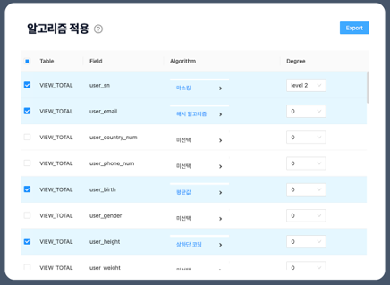
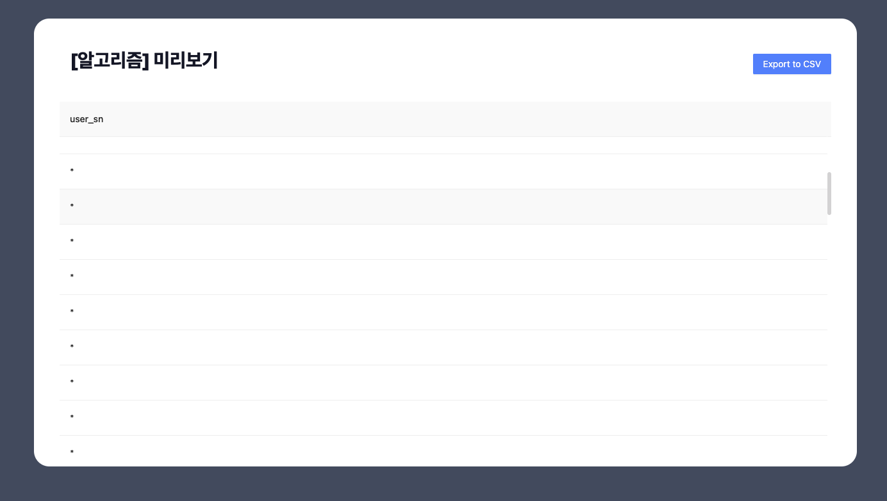

## 인트인 관리자페이지 프로토타입

l 기간 : `2022. 10 ~ 2022. 12`

l 소개 : 회사 내 고객 정보에 특정 알고리즘을 적용시켜
익명화한 데이터를 CSV파일로 확인 가능

l 주요 내용 :

- 관리자가 사용자의 정보를 여러 알고리즘을 적용하여, 사용자 데이터의 익명화
- 관리자가 익명화 시키길 원하는 정보를 CSV 파일로 변환
<table>
   <tr>
     <td align="center">적용 페이지</td>
     <td align="center">적용 결과</td>
   </tr>
   <tr>
     <td align="center"></td>
     <td align="center"></td>
   </tr>

 </table>
| 스킬:

- `"react-router-dom": "6.4"`
- `"lottie-react": "2.3.1"`
- `"react": "18.2.0"`
- `"@emotion/styled": "11.10.5"`
- `"antd": "4.23.5"`
- `"tailwindcss": "3.1.8"`
